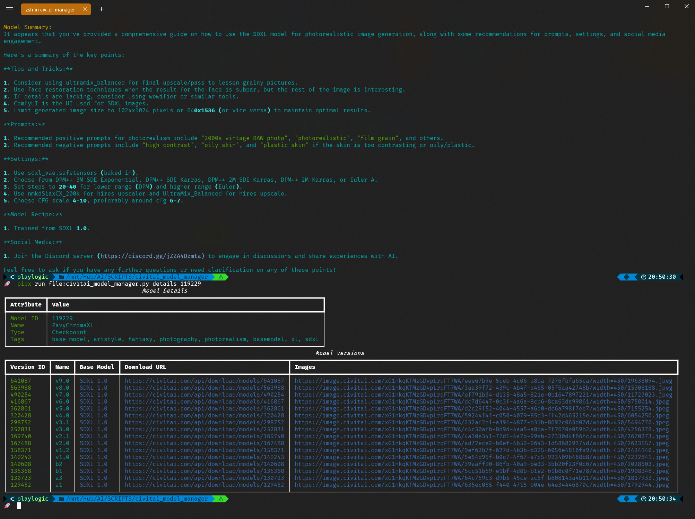

# Civitai CLI Manager

> [!NOTE]
Release 0.5.0 made the project a proper installable package and less of a stand-alone script. if you had a version before 0.5.0, it is recommended that you re-clone the repo and install the project
with `pipx install .` or `pip install .` To update the tool, you can run `pip install . --upgrade` or `pipx install . --upgrade` in the downloaded directory.
If you install with `pipx`, you can run the tool with `civitai-cli-manager` or `civitai-cli-manager --help` to see the available commands. If you install with `pip`, you can run the tool with `civitai_model_manager` or `civitai_model_manager --help` to see the available commands.

> [!WARNING]
> This tool is provided "as-is". It has primarily been used/tested on Ubuntu systems; YMMV on Windows/Subsystems but should work fine. I will be adding more features and testing on other platforms in the future as I move towards 1.0.0 release.

## Overview

**Civitai CLI Manager** is an unofficial Command Line Interface (CLI) tool I created to streamline the process of retrieving and managing AI models from the **Civitai platform**. This came about as a solution to quickly working with and manage models out
side the main site.

I initially intended for this to be just a module in a larger **Comfy CLI** toolset, but I found it so useful in its standalone format that I decided to share it with anyone who might feel the same way.



## Why

I needed a more efficient way to download, organize and manage my AI models from the site and the result is this CLI tool that allows me (and you) to store and manage models in a centralized directory. The tool also allows for a quick model summary 
via the Ollama(OpenAI), OpenAI or Groq if you choose. It is a great way to get a quick overview of a model's capabilities without having to download it first or read a lengthy description that may not be in your native language.

## Key Features

- **Quick Model Listing**: This tool will quickly list all available models alongside their types and storage paths.

- **Searchable Models**: You can search for specific models via the api using plain text or tags.

- **Categorical Stats**: Stats are available for each model type, including the number of models and their sizes.

- **Detailed Insights**: It retrieves comprehensive information about specific models using their IDs.

- **Effortless Downloads**: You can download selected model variants with ease, avoiding the tedious web interface. Just put any model ID or version ID you want to download in and the tool will handle the rest.

- **Simplified Removals**: Easily remove unnecessary models from local storage to keep things tidy.

- **Summarized Descriptions**: Get summaries of specific models by using 3 different LLMs for enhanced understanding.

## Installation (Recommended)

You have a couple of options for installing/running the tool:

### Install [pipx](https://pipxproject.github.io/pipx/installation/), then run the tool with the following command


```bash
pipx install .
```

### Alternatively, you can install using `pip`

```bash
pip install .
```


Run tests with:

> [!NOTE]
You will need to have the `pytest` package installed to run the tests.
Also, testing is not yet complete, so expect some failures...cause I have a 1 year old so time is limited. I will get to it...eventually. I know python....tests are important.

```bash
python test_civitai_model_manager.py
```

## Configuration

> [!IMPORTANT]
> Before using the tool, It's required to set up a `.env` file in the parent directory of the script or your home dir with the following environment variables:

```env
CIVITAI_TOKEN=#https://developer.civitai.com/docs/getting-started/setup-profile#create-an-api-key
MODELS_DIR= #/location/of/your/models/

OLLAMA_API_BASE= # http://localhost:11434 or http://host.docker.internal:11434
OLLAMA_MODEL=tinydolphin # Tuned to tinydolphin..as best I could
HTML_OUT=False # Some models require HTML conversion, some don't
TEMP=0
TOP_P=0

OPENAI_MODEL=gpt-4o-mini
OPENAI_API_KEY= # sk-proj

GROQ_MODEL=llama-3.1-70b-versatile
GROQ_API_KEY=#//
```

The application intelligently locates your `.env` file, accommodating various platforms like Windows and Linux, or defaulting to the current directory.

## Usage

> [!NOTE]
You can use the `search` command to search for models by name or tag to get the model ID.

You can also grab the ID from the Civitai... The model ID is the number in the URL after `/models/`, like so: https://civitai.com/models/`277058`/epicrealism-xl or https://civitai.com/models/`277058`/epicrealism-xl/versions/`453435`. Each model has a unique ID that can be used to download the model and a version ID that can be used to download a specific version of the model.

### Available Commands

Once installed via pipx or pip:

```bash
# List all available models
civitai-cli-manager --list

# Statistically summarize all models
civitai-cli-manager --stats

# Get detailed information about a specific model [display images or description]
civitai-cli-manager --details 12345 [--images | --desc]

# Download a specific model variant [select flag will prompt you to select a model]
civitai-cli-manager --download 54321 [--select]

# Remove models from local storage
civitai-cli-manager --remove

# Get a summary of a specific model with a options to select a LLM [--service ollama | openai | groq]
civitai-cli-manager --explain 12345 [--service ollama | openai | groq]
```

## Dependencies

This tool requires Python 3.11 or higher and has the following dependencies:

```plaintext
- typer
- rich
- requests
- shellingham
- tqdm
- civitai
- python-dotenv
- questionary
- ollama
- openai
```

These dependencies enhance usability, including user interactions, downloadable progress visuals, and environment variable management.

## To-Do List

- [X] Add search locations for `.env`
- [X] Add groqCloud integration
- [X] Add sanity checks for permissions, folder locations, feedback
- [ ] Add feature to download a update to a model if it already exists
- [ ] Add feature to download a specific version of a model

### Contact

For any inquiries, feedback, or suggestions, please feel free to open an issue on this repository.

### License

This project is licensed under the [MIT License](LICENSE).

---
